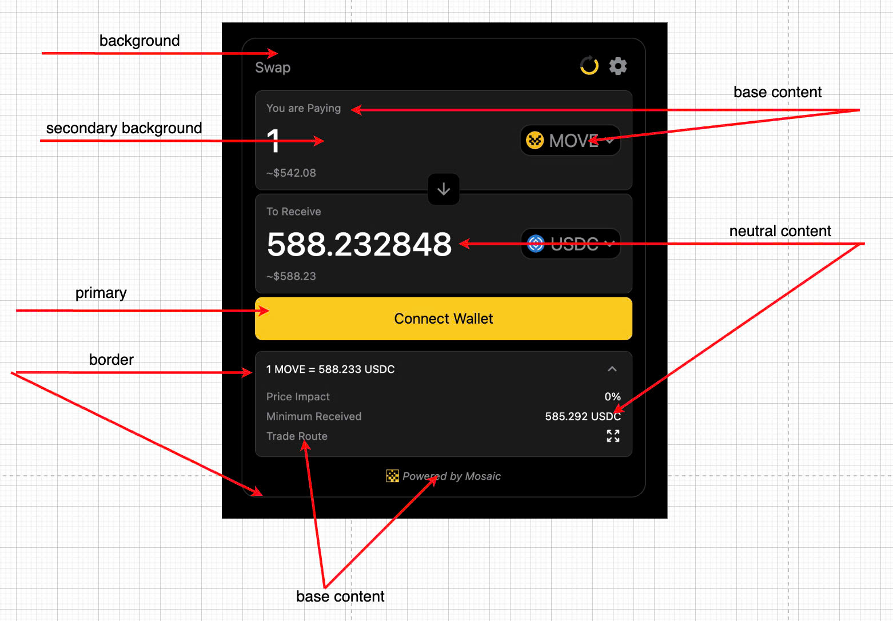
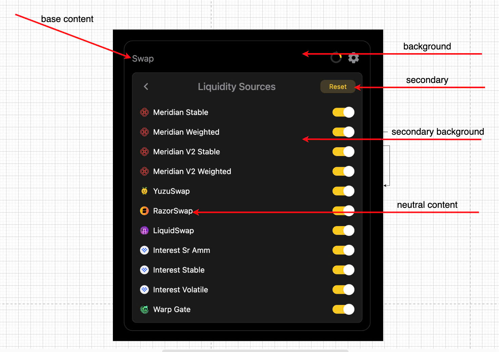
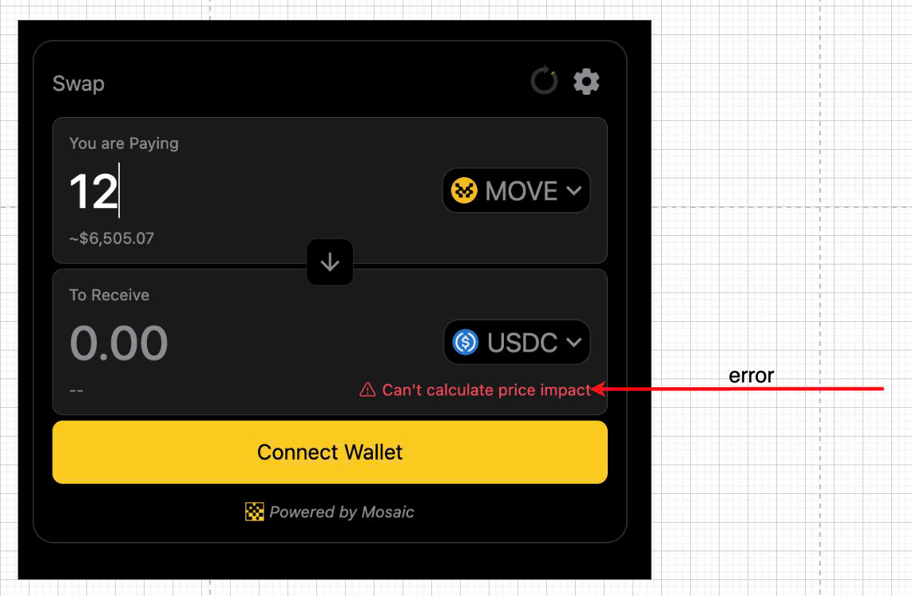

# Swap Widget

The Swap Widget bundles the whole swapping experience into a single React component that developers can easily embed in their app with a few lines of code.

[Here](https://swap-widget-demo.vercel.app/) is a live preview of the swap widget.

<div data-full-width="false"><figure><figcaption></figcaption></figure></div>

### Installing the Widgets Library

Install the widgets library via `npm` ,`pnpm` or `yarn`.

```js
yarn add @mosaicag/swap-widget
```

or

```js
npm i --save @mosaicag/swap-widget
```

### Adding the Swap Widget to Your App

* Register for an new `API key` with the Mosaic Team, [see here](https://docs.mosaic.ag/swap-integration/integration-partners#note-api-key-requirement)
* Import `@mosaicag/swap-widget/style.css` in the root component in react, (ex: main.tsx/App.tsx)

```js
import '@mosaicag/swap-widget/style.css' 
import SwapWidget from '@mosaicag/swap-widget'

function App() {
  <div className="Mosaic">
    ...
    <SwapWidget wallet={wallet} apiKey='...'/>
    ...
  </div>
}
```

### Wallet Interaction

* A lot of wallets are coming to Movement. You are free to use any wallet you want.
* The swap widget uses a `wallet` prop to allow users to sign and submit transactions ([details here](https://www.npmjs.com/package/@mosaicag/swap-widget))

### Customize theme

```js
<SwapWidget 
  wallet={wallet}
  apiKey="your api key"
  theme={{
    background: 'white',
    baseContent: 'black',
    border: 'gray',
    error: '#f6465d',
    neutralContent: 'black',
    primary: 'rgb(49, 203, 158)',
    secondary: 'rgba(49, 203, 158, 0.3)',
    secondaryBackground: '#f3f5fa'
  }}
/>

```

<figure><figcaption></figcaption></figure>

<figure><figcaption></figcaption></figure>

<figure><figcaption></figcaption></figure>

### [List of configurations](https://www.npmjs.com/package/@mosaicag/swap-widget)

### [Demo & example](https://swap-widget-demo.vercel.app/)

### Feature request & Report issue

* Feel free to contact us to request new config/report bug if you think it might be helpful.
* Please reach out to us via Discord or email us directly at **huy@mosaic.ag** for assistance and further details.
